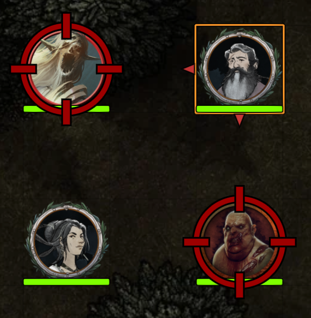
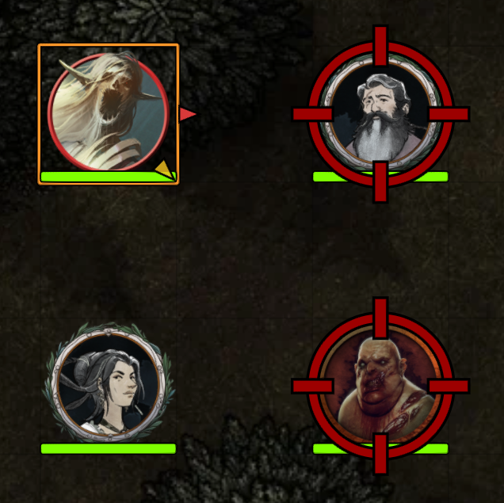
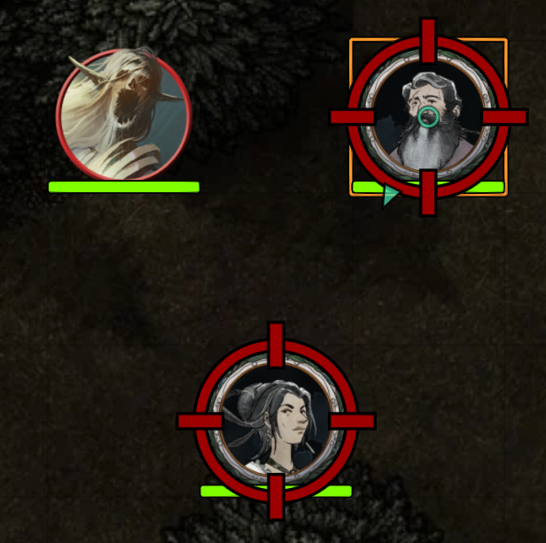
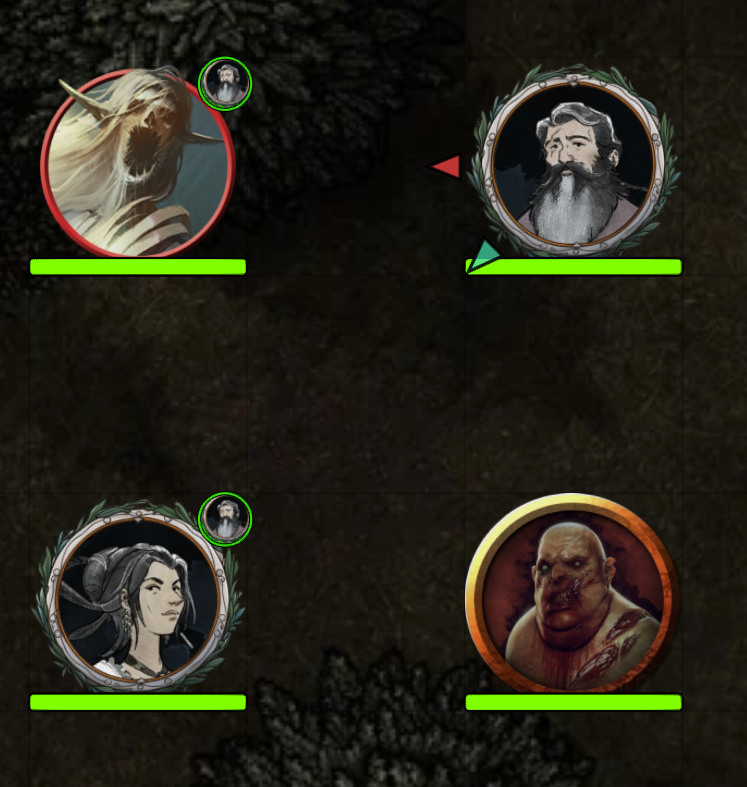
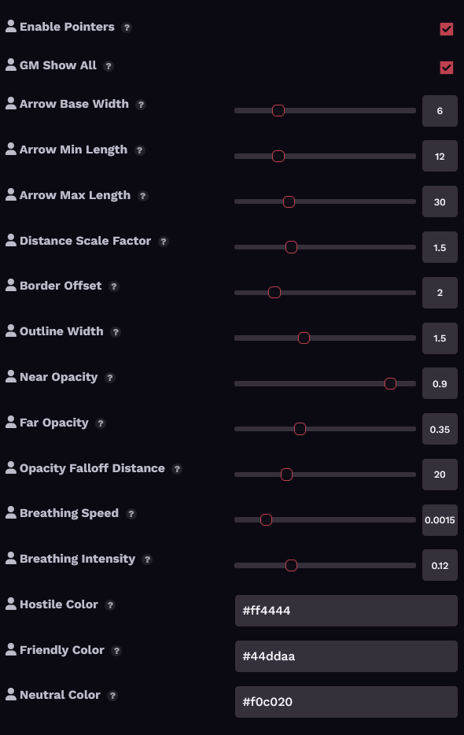

# Target Direction Pointer

A [Foundry VTT](https://foundryvtt.com/) module that draws directional arrows on the border of your token pointing toward each of your targets.


> **Note:** Module contains no AI-generated art or game content. I came up with the idea and guided the design decisions; [Claude](https://claude.ai) (Anthropic) assisted with the code, settings, and documentation.



## Features

- **Directional arrows** on your token's border, one per target
- **Relationship-based coloring**: red for hostile ↔ friendly, teal for friendly ↔ friendly, yellow for hostile ↔ hostile or ambiguous
- **Arrow width scales** with source token size
- **Arrow length scales** with distance to target
- **Opacity falloff** — distant targets fade out
- **Self-target indicator** — a centered ring when targeting your own token
- **GM "show all" mode** — see targeting arrows on every player's character token
- **Subtle breathing animation** — gentle pulse (configurable or disable)
- **Keyboard toggle** — no default binding; assignable in Configure Controls
- **Fully configurable** — every parameter adjustable in Module Settings




*Hostile token targeting friendly and hostile tokens. Red toward friendlies, yellow toward the other hostile.*



*Friendly token targeting other friendly tokens. Arrows are teal.*



*GM view with "Show All" enabled. Arrows visible on multiple tokens at once.*

## Installation

### Manifest URL (recommended)

1. In Foundry VTT, go to **Add-on Modules** → **Install Module**
2. Paste this URL into the **Manifest URL** field:
   ```
   https://github.com/miniaturepancake/foundryvtt-module-target-direction-pointer/releases/latest/download/module.json
   ```
3. Click **Install**

### Manual

1. Download `module.zip` from [Releases](https://github.com/miniaturepancake/foundryvtt-module-target-direction-pointer/releases)
2. Extract to `<FoundryData>/Data/modules/target-direction-pointer/`
3. Restart Foundry and enable the module in your world

## Settings

All settings are per-client.



| Setting | Default | Description |
|---|---|---|
| Enable Pointers | ✓ | Master toggle |
| GM: Show All Targets | ✓ | GM sees all players' targeting arrows |
| Arrow Width | 6 | Half-width of arrow base (scales with token) |
| Arrow Min Length | 12 | Minimum arrow length in pixels |
| Arrow Max Length | 30 | Maximum arrow length (scales with token) |
| Distance Length Factor | 1.5 | Arrow growth per grid-unit of distance |
| Border Offset | 2 | Gap between token edge and arrow |
| Outline Width | 1.5 | Dark outline around arrows |
| Near Target Opacity | 0.90 | Opacity for nearby targets |
| Far Target Opacity | 0.35 | Opacity floor for distant targets |
| Opacity Falloff Distance | 20 | Grid-units over which opacity decays |
| Breathing Speed | 0.0015 | Animation speed (0 to disable) |
| Breathing Depth | 0.12 | Animation amplitude (0 to disable) |
| Hostile Color | #ff4444 | Cross-disposition targeting |
| Friendly Color | #44ddaa | Friendly-to-friendly targeting |
| Neutral Color | #f0c020 | Same-hostile or ambiguous targeting |

## Color Logic

| Source → Target | Color | Reasoning |
|---|---|---|
| Hostile → Friendly | Red | Combat intent |
| Friendly → Hostile | Red | Combat intent |
| Friendly → Friendly | Teal | Support / buff / heal |
| Hostile → Hostile | Yellow | Ambiguous |
| Anything with Neutral/Secret | Yellow | Ambiguous |

## Compatibility

- **Foundry VTT**: v13
- **Systems**: System-agnostic
- **Conflicts**: None known

## License

[MIT](LICENSE)
